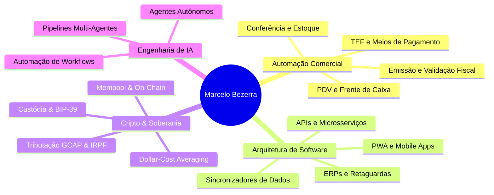

# Olá, sou Marcelo Bezerra 👋

  
  
  
  
  

 

> **Consultor de Tecnologia da Informação | Arquiteto de Soluções & Automação Comercial | Entusiasta Cripto & Soberania Digital**

Com mais de **28 anos de experiência** no mercado de tecnologia e negócios, atuo no desenho, implantação e evolução de ecossistemas completos de software para empresas de atacado, varejo, distribuição, postos de combustíveis e esteiras financeiras.

Minha abordagem combina **visão estratégica de negócios**, **engenharia de sistemas robustos** e **esteiras modernas de inteligência artificial autônoma**.

---

## 🏛️ Pilares de Atuação & Competências

---

## 🚀 Showcase Conceitual de Soluções Corporativas

Abaixo estão alguns dos ecossistemas de software e soluções corporativas sob minha concepção e arquitetura:

### 1. 🏬 Seta — Hub de Automação Comercial & Varejo
Plataforma integrada de gestão para postos de combustíveis e varejo em geral, unificando retaguarda operacional, faturamento, conciliação fiscal e controle de bicos/abastecimentos.
- **Foco de Negócio:** Eliminação de gargalos operacionais e conformidade fiscal instantânea.
- **Arquitetura:** Microsserviços integrados, bancos relacionais de alta performance e sincronizadores em tempo real.

### 2. 📍 SalesVisit PRO — Gestão de Força de Vendas Externa
Plataforma moderna voltada para equipes comerciais em campo, integrando roteirização inteligente, geolocalização e histórico analítico de clientes.
- **Foco de Negócio:** Maximização do tempo produtivo de vendedores externos e auditoria de visitas.
- **Arquitetura:** Next.js, React, TypeScript, geolocalização e sincronização offline-first (PWA).

### 3. 📦 Nota Certa & Estoque Fácil — Conferência e Inventário Ágil
Aplicações focadas na auditoria física de mercadorias por leitura de código de barras em tempo real, confrontando itens físicos com o arquivo fiscal (XML da NF-e).
- **Foco de Negócio:** Prevenção de perdas, conferência rápida de recebimento e controle de inventário.
- **Arquitetura:** Interfaces responsivas de alta velocidade, processamento direto no navegador/coletor.

### 4. 🧠 Ecossistema LUKOS & CRM Estratégico
Plataforma especializada na estruturação de funis de prospecção, pipeline de vendas consultivas e onboarding de clientes empresariais.
- **Foco de Negócio:** Aceleração do ciclo comercial e visibilidade executiva de métricas.

---

## 🛠️ Central de Ferramentas Open Source & Utilitários Públicos

Todas as ferramentas operam **100% no navegador (Client-Side)** com privacidade total e estão disponíveis no [**Hub Central de Ferramentas**](https://marcelotpbezerra.com.br/tools/):

### 🏢 Fiscal, ERP & Varejo
1. 📄 [**danfe-generator-pro**](https://github.com/marcelotpbezerra/danfe-generator-pro) • [🔗 Live](https://marcelotpbezerra.com.br/tools/danfe/): Visualizador e gerador de DANFE (NF-e 55) e DACTE (CT-e 57) com código de barras Code-128, canhoto e PDF oficial SEFAZ.
2. 🔍 [**nfe-key-decoder**](https://github.com/marcelotpbezerra/nfe-key-decoder) • [🔗 Live](https://marcelotpbezerra.com.br/tools/chave-nfe/): Decodificador das 44 posições de chaves fiscais com cálculo e validação do Dígito Verificador (Módulo 11 SEFAZ).
3. 🧮 [**retail-markup-simulator**](https://github.com/marcelotpbezerra/retail-markup-simulator) • [🔗 Live](https://marcelotpbezerra.com.br/tools/markup/): Simulador de Markup multiplicador/divisor, formação de preço no varejo, DRE unitária e Ponto de Equilíbrio.
4. 🛡️ [**nfe-xml-linter**](https://github.com/marcelotpbezerra/nfe-xml-linter) • [🔗 Live](https://marcelotpbezerra.com.br/tools/xml-linter/): Auditor prévio de XMLs fiscais para detecção de causas de rejeição SEFAZ (531, divergências, NCM/CFOP).
5. 📊 [**excel-header-normalizer**](https://github.com/marcelotpbezerra/excel-header-normalizer) • [🔗 Live](https://marcelotpbezerra.com.br/tools/excel/): Padronizador universal de planilhas Excel/CSV para ERPs e bancos de dados (snake_case, SQL, JSON).

### 🪙 Criptoativos & Soberania Digital
6. 🧾 [**crypto-tax-calculator**](https://github.com/marcelotpbezerra/crypto-tax-calculator) • [🔗 Live](https://marcelotpbezerra.com.br/tools/cripto-irpf/): Calculadora de Isenção de R$ 35k/mês (Art. 35 Lei 8.981/95), Preço Médio Ponderado e apuração de DARF Cripto (4600 / GCAP).
7. ⚡ [**sats-mempool-converter**](https://github.com/marcelotpbezerra/sats-mempool-converter) • [🔗 Live](https://marcelotpbezerra.com.br/tools/sats-converter/): Conversor universal de Satoshis para BRL/USD, monitor de taxas on-chain da Mempool e simulador de consolidação de UTXOs.
8. 📈 [**btc-dca-simulator**](https://github.com/marcelotpbezerra/btc-dca-simulator) • [🔗 Live](https://marcelotpbezerra.com.br/tools/dca-bitcoin/): Simulador de aportes recorrentes (Dollar-Cost Averaging) em Bitcoin confrontado com CDI 100%, Poupança e Inflação IPCA.
9. 🔑 [**bip39-seed-inspector**](https://github.com/marcelotpbezerra/bip39-seed-inspector) • [🔗 Live](https://marcelotpbezerra.com.br/tools/bip39-inspector/): Inspetor, validador de Checksum SHA-256 e autocompletador de seed phrases BIP-39 (12 e 24 palavras) 100% offline / Air-Gapped.

---

## 🔒 Soberania de Dados & Infraestrutura Privada

Adoto uma filosofia estrita de **Soberania Digital e Proteção de Ativos Intelectuais**:
- Todo o código-fonte proprietário, regras fiscais e dados de clientes operam em **servidores privados auto-hospedados** com criptografia de ponta a ponta e redundância automatizada.
- Mantenho este perfil no GitHub prioritariamente como **vitrine conceitual, portfólio institucional e ferramentas open-source**.

---

## 🌐 Conecte-se Comigo

- 🔗 **Website Oficial:** [marcelotpbezerra.com.br](https://marcelotpbezerra.com.br/)
- 🛠️ **Hub de Ferramentas:** [marcelotpbezerra.com.br/tools/](https://marcelotpbezerra.com.br/tools/)
- 📱 **Linktree:** [linktr.ee/marcelotpbezerra](https://linktr.ee/marcelotpbezerra)
- 🛠️ **Git Soberano (Self-Hosted):** [git.marcelotpbezerra.com.br](https://git.marcelotpbezerra.com.br/marcelo)
- 💼 **LinkedIn:** [linkedin.com/in/marcelotpbezerra](https://www.linkedin.com/in/marcelotpbezerra/)
- ✉️ **E-mail:** [contato@marcelotpbezerra.com.br](mailto:contato@marcelotpbezerra.com.br)
