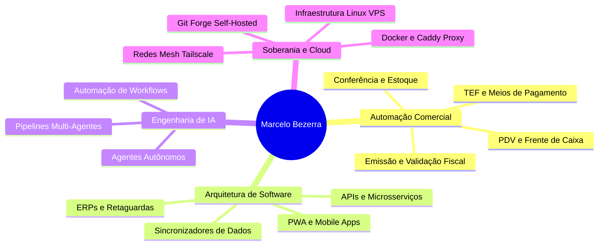

# Olá, sou Marcelo Bezerra 👋

  
  
  
  

 

> **Consultor de Tecnologia da Informação | Arquiteto de Soluções & Automação Comercial | Entusiasta Cripto & Soberania Digital**

Com mais de **28 anos de experiência** no mercado de tecnologia e negócios, atuo no desenho, implantação e evolução de ecossistemas completos de software para empresas de atacado, varejo, distribuição e postos de combustíveis.

Minha abordagem combina **visão estratégica de negócios**, **engenharia de sistemas robustos** e **esteiras modernas de inteligência artificial autônoma**.

---

## 🏛️ Pilares de Atuação & Competências

---

## 🚀 Showcase Conceitual de Soluções

Abaixo estão alguns dos ecossistemas de software e soluções corporativas sob minha concepção e arquitetura:

### 1. 🏬 Seta — Hub de Automação Comercial & Varejo
Plataforma integrada de gestão para postos de combustíveis e varejo em geral, unificando retaguarda operacional, faturamento, conciliação fiscal e controle de bicos/abastecimentos.
- **Foco de Negócio:** Eliminação de gargalos operacionais e conformidade fiscal instantânea.
- **Arquitetura:** Microsserviços integrados, bancos relacionais de alta performance e sincronizadores em tempo real.

### 2. 📍 SalesVisit PRO — Gestão de Força de Vendas Externa
Plataforma moderna voltada para equipes comerciais em campo, integrando roteirização inteligente, geolocalização e histórico analítico de clientes.
- **Foco de Negócio:** Maximização do tempo produtivo de vendedores externos e auditoria de visitas.
- **Arquitetura:** Next.js, React, TypeScript, geolocalização e sincronização offline-first (PWA).

### 3. 📦 Nota Certa & Estoque Fácil — Conferência e Inventário Ágil
Aplicações focadas na auditoria física de mercadorias por leitura de código de barras em tempo real, confrontando itens físicos com o arquivo fiscal (XML da NF-e).
- **Foco de Negócio:** Prevenção de perdas, conferência rápida de recebimento e controle de inventário.
- **Arquitetura:** Interfaces responsivas de alta velocidade, processamento direto no navegador/coletor.

### 4. 🧠 Ecossistema LUKOS & CRM Estratégico
Plataforma especializada na estruturação de funis de prospecção, pipeline de vendas consultivas e onboarding de clientes empresariais.
- **Foco de Negócio:** Aceleração do ciclo comercial e visibilidade executiva de métricas.

---

## 📦 Ferramentas Open Source & Utilitários Públicos

- 📄 [**danfe-generator-pro**](https://github.com/marcelotpbezerra/danfe-generator-pro) • [🔗 Live Demo](https://marcelotpbezerra.com.br/danfe/): Visualizador e gerador de DANFE (NF-e - Modelo 55) e DACTE (CT-e - Modelo 57) com impressão A4, exportação para PDF e cópia estruturada de tributos. Processamento 100% no navegador (privacidade total).
- 📊 [**excel-header-normalizer**](https://github.com/marcelotpbezerra/excel-header-normalizer): Ferramenta web para padronização de cabeçalhos de planilhas Excel/CSV com exportação direta para CSV, JSON e scripts SQL (`CREATE TABLE` + `INSERT`).
- 📱 [**nextjs-pwa-starter**](https://github.com/marcelotpbezerra/nextjs-pwa-starter): Template canônico e pronto para produção de Progressive Web Apps (PWA) no ecossistema Next.js 15, com prompts nativos de instalação para Android e iOS.

---

## 🔒 Soberania de Dados & Infraestrutura Privada

Adoto uma filosofia estrita de **Soberania Digital e Proteção de Ativos Intelectuais**:
- Todo o código-fonte proprietário, regras fiscais e dados de clientes operam em **servidores privados auto-hospedados** com criptografia de ponta a ponta e redundância automatizada.
- Mantenho este perfil no GitHub prioritariamente como **vitrine conceitual, portfólio institucional e ferramentas open-source**.

---

## 🌐 Conecte-se Comigo

- 🔗 **Website Oficial:** [marcelotpbezerra.com.br](https://marcelotpbezerra.com.br/)
- 📱 **Linktree:** [linktr.ee/marcelotpbezerra](https://linktr.ee/marcelotpbezerra)
- 🛠️ **Git Soberano (Self-Hosted):** [git.marcelotpbezerra.com.br](https://git.marcelotpbezerra.com.br/marcelo)
- 💼 **LinkedIn:** [linkedin.com/in/marcelotpbezerra](https://www.linkedin.com/in/marcelotpbezerra/)
- ✉️ **E-mail:** [contato@marcelotpbezerra.com.br](mailto:contato@marcelotpbezerra.com.br)
